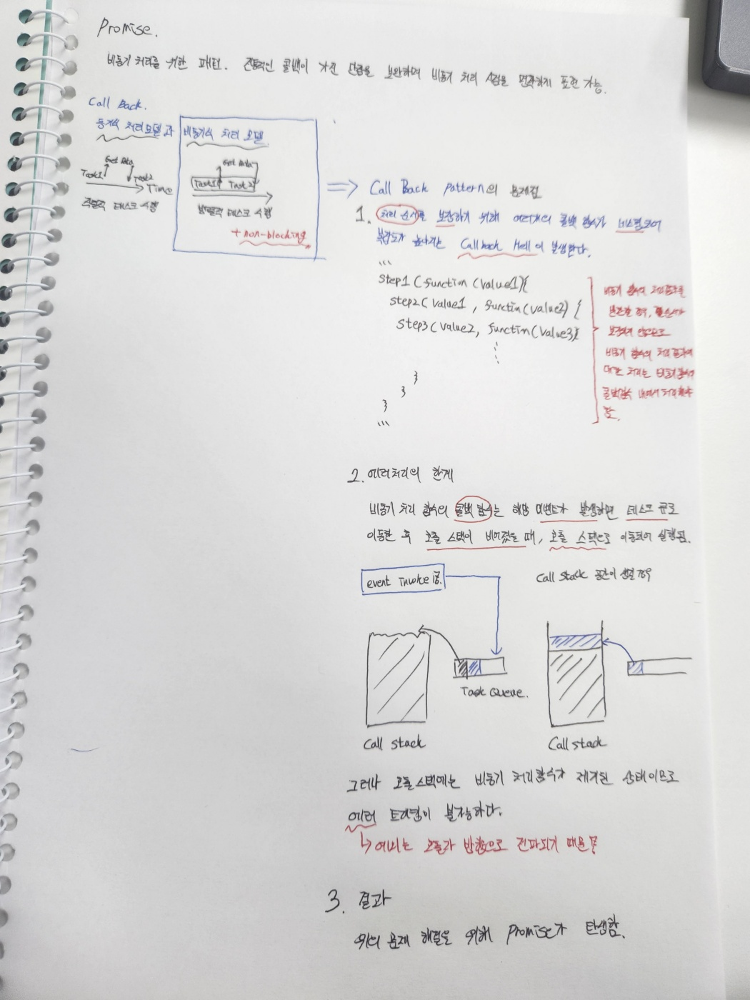

### 개요
자바스크립트의 꽃 비동기 프로그래밍과 콜백함수 부터 시작된 비동기 처리에 대한 불편함을 극복하기 위해 발전된 프로미스와 async/await과 같은 개념들에 대해 알아볼 것이다.

### Async
non-block I/O 가 가능한 언어는 클라이언트의 요청을 4배 이상 받을 수 있다(처리가 가능하다와는 다른 의미). 멀티 쓰레드 기반 언어는 I/O 처리를 대기해야하는 반면 싱글쓰레드 non-block는 이벤트 루프를 통해 OS에게 I/O 처리를 위임하기 때문에 더 많은 요청을 수용할 수 있다.




#### 커스텀 Promise 객체
```JavaScript
class MyPromise{
    succ = [];
    fail = [];
    final = [];

    constructor(cb) {
        cb(this.resolve.bind(this),this.reject);
    }

    finalExec() {
        for(const fn of this.final) fn();
    }

    //?
    catchExec(err) {
        const fn  = fail.shift();
        if(!fn) {
            this.finalExec();
            if(err instanceof Error) throw err;
            else throw new Error(err);
        }
    }

    resolve(value) {
        const fn = this.succ.shift();
        if(!fn) {
            return this.finalExec();
        }
        try{
            fn(value);
            this.resolve(value);
        }catch (error) {
            catchExec(error);
        }
    }

    then(cb) {
        this.succ.push(cb);
        return this;
    }

    catch(cb) {
        this.fail.push(cb);
        return this;
    }

    finally(cb) {
        this.final.push(cb);
        return this;
    }
}


const promi = new MyPromise((resolve,reject)=>{
    console.log('promi');
    setTimeout(()=>{
        resolve('Success');
    },1000, this);
});

promi.then((res) => console.log(res)).then(res=>console.log(2)).finally(res=>console.log('final1'));
```